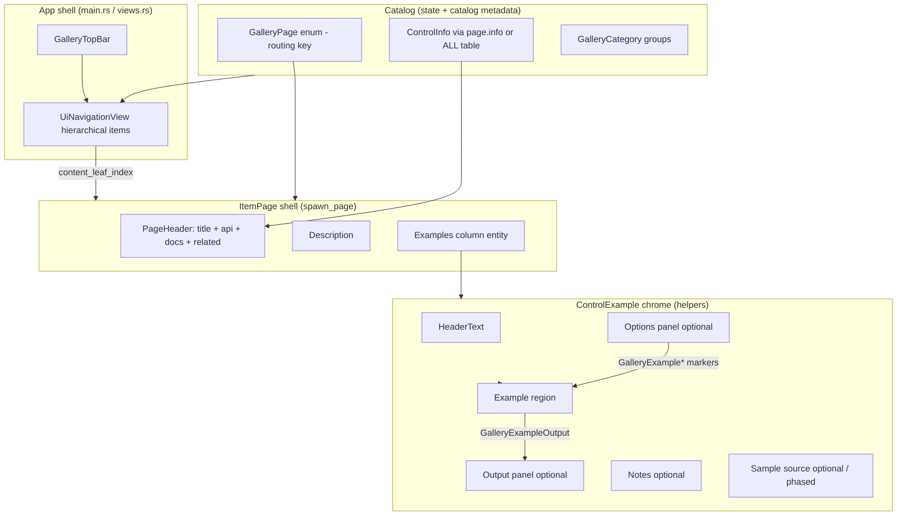
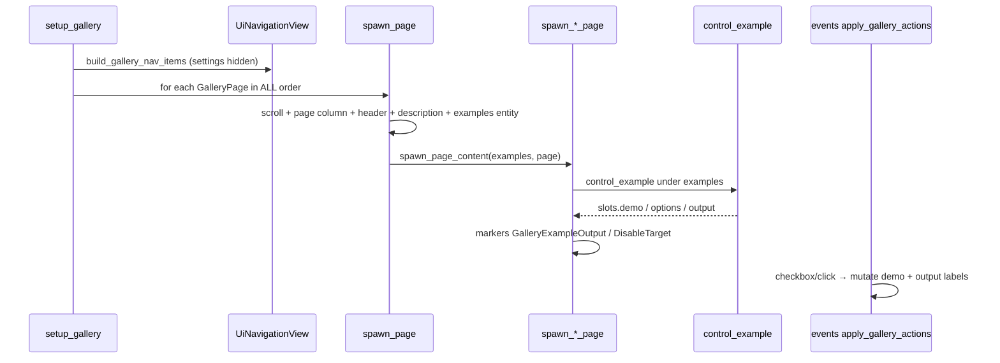
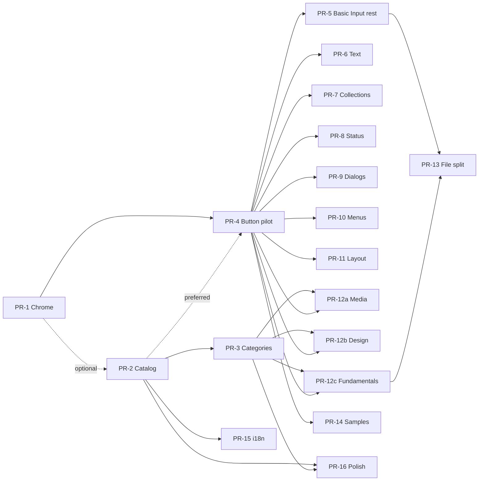

# Design: Picus Gallery → WinUI-Gallery Content Parity

| Field | Value |
|-------|--------|
| **Title** | Transform `examples/gallery` (`example_gallery`) toward WinUI-Gallery-style per-control content pages |
| **Author** | TBD |
| **Date** | 2026-07-18 |
| **Status** | Draft (rev 4 — user open-question decisions incorporated) |
| **Package** | `example_gallery` at [`examples/gallery/`](C:\Users\Summp\source\repos\picus\examples\gallery) |
| **Reference** | [`WinUI-Gallery`](C:\Users\Summp\source\repos\WinUI-Gallery) (local sibling checkout) |
| **Scope** | Design / migration plan only — **no implementation in this document** |

---

## Overview

Picus Gallery already mirrors WinUI Gallery at the **navigation shell** level: hierarchical `UiNavigationView` categories, one `GalleryPage` enum variant per control (41 pages), and per-page scroll + title + description chrome in `spawn_page` ([`main.rs`](C:\Users\Summp\source\repos\picus\examples\gallery\src\main.rs)). Content inside each page does **not** yet share a WinUI-like structure: cards are ad-hoc (`helpers::card` + variable `grid` columns), there is no Options/Output region, no sample-source presenter, and page headers lack API/docs/related-control metadata.

This design specifies how to make **内容页尽可能一致** (content pages as consistent as possible) by introducing:

1. A canonical **ItemPage shell** (header + description + example stack).
2. A shared **ControlExample** chrome (header, demo, optional options/output/notes/source).
3. A catalog metadata model aligned with WinUI `ControlInfoData`, with **hard bijection tests**.
4. An incremental PR plan (one category per migration PR) that keeps the gallery runnable after every merge.

Framework APIs stay untouched unless a tiny example-local helper is insufficient. All gallery code continues to depend on the **`picus` facade only**.

---

## Background & Motivation

### Current Picus gallery architecture

```
examples/gallery/
├── assets/
│   ├── locales/{en-US,ja-JP,zh-CN}/main.ftl   # only I18n demo keys today
│   └── themes/gallery.ron                     # explicit stylesheet (no auto dark/light)
└── src/
    ├── main.rs      # shell: top bar, nav items, spawn_page chrome
    ├── state.rs     # GalleryPage enum, CATEGORIES, labels/descriptions/icons
    ├── helpers.rs   # card, grid, note, placeholder, toast/dialog buttons
    ├── events.rs    # PendingGalleryActions collect → apply
    ├── views.rs     # GalleryRoot, GalleryTopBar (UiComponent)
    └── pages/
        ├── mod.rs   # spawn_page_content match → category modules
        ├── basic_input.rs | text.rs | collections.rs | menus.rs
        ├── status.rs | dialogs.rs | layout.rs | design.rs
```

**What already matches WinUI:**

| WinUI concept | Picus today |
|---------------|-------------|
| One nav leaf ≈ one control | `GalleryPage` 41 variants + `ALL` leaf order |
| Category parents | `GalleryPage::CATEGORIES` → expandable `NavigationViewItem`s |
| ItemPage frame host | `spawn_page` → `UiScrollView` → page column → `pages::spawn_page_content` |
| Per-control sample page | `spawn_*_page` functions (grouped by category file) |

**Pain points (verified in source):**

1. **Ad-hoc cards** — `card()` is only a titled `UiFlexColumn` with class `gallery.card`. Every page invents layout via `grid(parent, 1|2|4)` or raw `card(parent, …)` without options/output slots ([`helpers.rs`](C:\Users\Summp\source\repos\picus\examples\gallery\src\helpers.rs), [`basic_input.rs`](C:\Users\Summp\source\repos\picus\examples\gallery\src\pages\basic_input.rs)).
2. **No sample-source presenter** — WinUI loads `SampleDefinition` `.txt` (header/xaml/c#) into `SampleCodePresenter`; Picus has none.
3. **No shared Options / Output** — WinUI Button example wires Disable checkbox → Output TextBlock; Picus Button page only fires toasts via `GalleryButtonAction`.
4. **Thin page header** — only `gallery.section_title` + `gallery.page_description` labels; no API namespace, docs links, related controls.
5. **Category mega-files** — e.g. `basic_input.rs` holds 9 controls; WinUI uses `Samples/Button/ButtonPage.xaml`.
6. **Inconsistent section order** — some pages put notes inside cards, some use placeholders as sibling cards, Responsive skips the 2-col grid pattern entirely.
7. **i18n incomplete** — titles/descriptions are English `&'static str` in `state.rs`; FTL files only cover I18n demo strings.
8. **Settings leaf** — nav built with `.with_settings_visible(true)`; settings selection is ignored in `events.rs` (`is_settings_selected` → continue) while `leaf_count()` still includes settings.
9. **Search entity not captured** — `GalleryRuntime.search_input` is always `Entity::PLACEHOLDER`; real `UiSearch` is spawned under `GalleryTopBar` without recording.

### WinUI-Gallery reference model

Key files:

| Role | Path |
|------|------|
| Catalog | `WinUIGallery/SampleSupport/Data/ControlInfoData.json` |
| Item shell | `WinUIGallery/Pages/ItemPage.xaml` — PageHeader + description + Frame |
| Page header | `WinUIGallery/Controls/PageHeader.xaml` |
| Example chrome | `WinUIGallery/Controls/ControlExample.xaml` (+ `.cs`) |
| Per-control page | `Samples/<Control>/<Control>Page.xaml` — `StackPanel` of `ControlExample` |
| Sample snippets | `Samples/<Control>/*.txt` (`--- header`, `--- xaml`, `--- c#`) |

**ControlExample anatomy (must mirror conceptually):**

```
HeaderText (example title)
┌─────────────────────────────────────────────────────────┐
│ Example (live control) │ Output? │ Options? (knobs)    │
├─────────────────────────────────────────────────────────┤
│ [Expander] Source code  (XAML / C# tabs)                │
└─────────────────────────────────────────────────────────┘
```

---

## Goals & Non-Goals

### Goals

1. **One control per page content structure** — deepen consistency beyond nav/enum; every control page uses the same shell + example chrome.
2. **Shared ControlExample-equivalent** — title, demo body, optional options, optional output, optional notes, optional sample source (phased).
3. **Catalog metadata** — titles, subtitles, descriptions, tags, API type path, docs, related controls, category, badge flags — with **bijection tests** vs `GalleryPage::ALL`.
4. **Predictable file layout** — path from control id → page module is obvious.
5. **Placeholder rules** — missing Picus features use a single placeholder pattern, not fake demos.
6. **Incremental migration** — each PR keeps `cargo run -p example_gallery` and existing gallery tests green; **one category per content-migration PR**.
7. **Content-page consistency checklist** — implementers can review any new page mechanically (definition of done for “内容页尽可能一致”).

### Non-Goals

1. Full visual/feature parity with every WinUI sample (100+ controls).
2. Promoting gallery helpers into `picus` / `picus_widget` public API in phase 1–3 (revisit only if ≥2 examples need the same chrome).
3. Auto theme dark/light selection (forbidden by AGENTS; gallery already loads RON explicitly).
4. Deep-link protocol / favorites / copy-page-link (WinUI PageHeader extras) in early PRs. **Catalog docs links that open the system browser are in scope** (Polish PR / PR-16; see clickable docs design).
5. Real network image loading or video components solely for gallery demos.
6. Replacing `UiNavigationView` shell or inventing inventory/linkme registration.
7. Editing third-party submodule content.
8. Pixel-perfect WinUI side-panel **max-width** constraints in PR-1 (natural width default; fixed width only after Button pilot visual review — Key Decision 18).
9. Clipboard “copy sample” until a public clipboard path is investigated and accepted as a dependency.
10. Renaming the framework widget `UiSpinner` — only the **gallery page identity** becomes `ProgressRing` (display + `GalleryPage` variant); API type may still document `UiSpinner`.

---

## Proposed Design

### High-level architecture



### Canonical content-page template

Every control page must expand to this tree (classes map to `gallery.ron` rules):

```text
UiScrollView.gallery.content_scroll
└── UiFlexColumn.gallery.page                    # ItemPage root
    ├── PageHeader.gallery.page_header           # owned ONLY by spawn_page
    │   ├── UiLabel.gallery.section_title        # control Title
    │   ├── UiLabel.gallery.api_namespace        # e.g. picus::prelude::UiButton (optional)
    │   └── (PR-16) clickable docs UiLinks + related chips
    ├── UiLabel.gallery.page_description         # Item.Description
    └── UiFlexColumn.gallery.examples            # vertical stack — page modules spawn HERE only
        ├── ControlExample #1
        ├── ControlExample #2
        └── ControlExample #N  (or PlaceholderExample)
```

**Default example stack is a single-column vertical list** (WinUI `StackPanel` of `ControlExample`).  
**Forbidden at page root:** `grid(parent, 2)` / multi-column card grids. Grids remain valid *inside* a single example’s demo region (e.g. Grid page, icon boards).

#### `spawn_page` tree diff (PR-1)

**Before** (`main.rs` today):

```rust
fn spawn_page(commands: &mut Commands, nav_view: Entity, page: GalleryPage) {
    let scroll = /* UiScrollView → ChildOf(nav_view) */;
    let page_col = /* UiFlexColumn.gallery.page with title + description children */;
    pages::spawn_page_content(commands, page_col, page); // page content shares page_col with titles
}
```

**After:**

```rust
fn spawn_page(commands: &mut Commands, nav_view: Entity, page: GalleryPage) {
    let scroll = /* UiScrollView.gallery.content_scroll → ChildOf(nav_view) */;
    let page_col = commands.spawn_scene(bsn! {
        UiFlexColumn
        template_value(class("gallery.page"))
        ChildOf(scroll)
    }).id();

    // Header + description owned exclusively by the shell (page modules must not re-emit page title).
    spawn_page_header(commands, page_col, page); // title + optional api caption
    commands.spawn_scene(bsn! {
        template_value(UiLabel::new(page.description())) // later: page.info().description
        template_value(class("gallery.page_description"))
        ChildOf(page_col)
    });

    let examples = commands.spawn_scene(bsn! {
        UiFlexColumn
        template_value(class("gallery.examples"))
        ChildOf(page_col)
    }).id();

    pages::spawn_page_content(commands, examples, page); // ONLY the examples column
}
```

Signature change for content modules:

```rust
// parent is ALWAYS the gallery.examples column entity, never the page root.
pub fn spawn_page_content(commands: &mut Commands, examples: Entity, page: GalleryPage);
```



### ControlExample-equivalent API

#### Decision: example-local helpers first, not a framework `UiComponent`

Rationale:

- Gallery is demonstration code; AGENTS forbids over-engineering framework APIs.
- Demo bodies need imperative `Commands` + markers (`GalleryButtonAction`, `ManualOverlayMarker`) that fit spawn helpers better than pure projected components.
- Existing shell components (`GalleryRoot`, `GalleryTopBar`) already show when a true `UiComponent` is justified; ControlExample chrome is mostly static layout + style classes.

**Phase later:** if chrome stabilizes and another example needs it, extract a lookless `UiControlExample` into `picus_widget` with zero brand colors (styles only via RON).

#### Layout recipe (code-backed — no `max_width`)

**Constraint (verified):** `LayoutStyle` in Picus exposes padding/gap/corner_radius/border_width/justify/align/scale/`flex_grow` — **not** `max_width` / `min_width`. `UiGrid` track lengths exist, but the Masonry projector still largely falls back to **uniform cell sizing**, so it is **not** the Options/Output layout vehicle.

**Chosen recipe for `gallery.example_body`:**

| Region | Layout | Width behavior |
|--------|--------|----------------|
| Demo | `UiFlexColumn` with `layout.flex_grow: Some(1.0)` via `InlineStyle` or RON | Takes remaining row space |
| Output (optional) | `UiFlexColumn` **without** flex_grow | Natural width of labels; visual non-goal: no hard 240px cap |
| Options (optional) | `UiFlexColumn` **without** flex_grow | Natural width of knobs; visual non-goal: no hard 280px cap |

```text
UiFlexColumn.gallery.example
├── UiLabel.gallery.example_title
├── UiFlexRow.gallery.example_body          # gap from RON
│   ├── UiFlexColumn.gallery.example_demo   # flex_grow = 1.0
│   ├── UiFlexColumn.gallery.example_output # optional, natural width
│   └── UiFlexColumn.gallery.example_options # optional, natural width
├── UiLabel.gallery.note                    # optional
└── UiExpander (Samples PR / PR-14)         # sample source
```

**Optional refinement (same PR or follow-up):** if natural-width side panels feel too wide, apply a **gallery-only** fixed width using the existing `GalleryTopBar` pattern (`sized_box` + `Dimensions` / `Dim::Fixed` in a tiny `UiComponent` projector for `GalleryExampleSidePanel`). This stays example-local and does **not** extend `LayoutStyle`. Exact pixel caps matching WinUI are an explicit **visual non-goal**.

**PR-1 acceptance criteria for layout:**

- Body is a horizontal flex row when options and/or output are present; otherwise demo alone.
- Demo region grows (`flex_grow > 0`); side panels do not steal the whole row.
- No reliance on RON `max_width` (does not exist).
- Existing unmigrated `card()` pages keep their current paint classes (see PR-1 card policy).

#### Proposed helper surface (`chrome.rs`)

Prefer **`&'static str`** for titles/notes so authoring matches catalog ergonomics. Owned `String` only when a page must format at runtime (rare; i18n PR may later resolve to owned text at spawn).

```rust
#[derive(Clone, Copy, Debug)]
pub struct DocLink {
    pub title: &'static str,
    pub url: &'static str,
}

/// Regions returned so callers can spawn into demo / options / output.
///
/// When `with_output` is true, **`output_value` is the entity to pass to
/// `GalleryExampleOutput`** — do not walk children of `output` to find it.
pub struct ControlExampleSlots {
    pub root: Entity,
    pub demo: Entity,
    pub options: Option<Entity>,
    /// Output column container (`gallery.example_output`), if any.
    pub output: Option<Entity>,
    /// Mutable value `UiLabel` under the output column (empty string initially).
    pub output_value: Option<Entity>,
    /// Optional "Output" heading label (rarely needed by callers).
    pub output_heading: Option<Entity>,
}

#[derive(Clone, Copy, Debug)]
pub struct ControlExampleSpec {
    pub title: &'static str,
    pub with_options: bool,
    pub with_output: bool,
    /// Optional short note under the demo row (not a separate card).
    pub note: Option<&'static str>,
    /// Optional sample snippet id (Samples PR / PR-14+); ignored if None.
    pub sample_id: Option<&'static str>,
    /// When true, render as placeholder chrome (warning surface).
    pub placeholder: bool,
    pub placeholder_reason: Option<&'static str>,
}

impl ControlExampleSpec {
    pub const fn basic(title: &'static str) -> Self {
        Self {
            title,
            with_options: false,
            with_output: false,
            note: None,
            sample_id: None,
            placeholder: false,
            placeholder_reason: None,
        }
    }

    pub const fn with_io(title: &'static str) -> Self {
        Self {
            title,
            with_options: true,
            with_output: true,
            note: None,
            sample_id: None,
            placeholder: false,
            placeholder_reason: None,
        }
    }

    pub const fn placeholder(title: &'static str, reason: &'static str) -> Self {
        Self {
            title,
            with_options: false,
            with_output: false,
            note: None,
            sample_id: None,
            placeholder: true,
            placeholder_reason: Some(reason),
        }
    }
}

/// Spawn ControlExample chrome under `parent` (must be `gallery.examples` column).
pub fn control_example(
    commands: &mut Commands,
    parent: Entity,
    spec: ControlExampleSpec,
) -> ControlExampleSlots { /* see implementation sketch below */ }

/// Convenience: returns demo entity only.
pub fn example_basic(
    commands: &mut Commands,
    parent: Entity,
    title: &'static str,
) -> Entity {
    control_example(commands, parent, ControlExampleSpec::basic(title)).demo
}

/// Attach `GalleryExampleOutput` so demo clicks update the Output value label.
pub fn attach_output(commands: &mut Commands, demo: Entity, slots: &ControlExampleSlots) {
    if let Some(value) = slots.output_value {
        commands.entity(demo).insert(GalleryExampleOutput(value));
    }
}
```

#### PR-1 implementation sketch (`control_example` body)

```rust
pub fn control_example(
    commands: &mut Commands,
    parent: Entity,
    spec: ControlExampleSpec,
) -> ControlExampleSlots {
    let root_class = if spec.placeholder {
        "gallery.placeholder"
    } else {
        "gallery.example"
    };

    let root = commands
        .spawn_scene(bsn! {
            UiFlexColumn
            template_value(class(root_class))
            ChildOf(parent)
            Children [
                (
                    template_value(UiLabel::new(spec.title))
                    template_value(class("gallery.example_title"))
                ),
            ]
        })
        .id();

    if spec.placeholder {
        if let Some(reason) = spec.placeholder_reason {
            note(commands, root, reason);
        }
        return ControlExampleSlots {
            root,
            demo: root,
            options: None,
            output: None,
            output_value: None,
            output_heading: None,
        };
    }

    let body = commands
        .spawn_scene(bsn! {
            UiFlexRow
            template_value(class("gallery.example_body"))
            ChildOf(root)
        })
        .id();

    let demo = commands
        .spawn_scene(bsn! {
            UiFlexColumn
            template_value(class("gallery.example_demo"))
            template_value(InlineStyle {
                layout: LayoutStyle {
                    flex_grow: Some(1.0),
                    ..Default::default()
                },
                ..Default::default()
            })
            ChildOf(body)
        })
        .id();

    let (output, output_heading, output_value) = if spec.with_output {
        let output = commands
            .spawn_scene(bsn! {
                UiFlexColumn
                template_value(class("gallery.example_output"))
                ChildOf(body)
            })
            .id();
        // Spawn heading and value as separate entities so we keep Entity ids.
        let output_heading = commands
            .spawn_scene(bsn! {
                template_value(UiLabel::new("Output"))
                ChildOf(output)
            })
            .id();
        let output_value = commands
            .spawn_scene(bsn! {
                template_value(UiLabel::new(""))
                template_value(class("gallery.example_output_value"))
                ChildOf(output)
            })
            .id();
        (Some(output), Some(output_heading), Some(output_value))
    } else {
        (None, None, None)
    };

    let options = spec.with_options.then(|| {
        commands
            .spawn_scene(bsn! {
                UiFlexColumn
                template_value(class("gallery.example_options"))
                ChildOf(body)
            })
            .id()
    });

    if let Some(text) = spec.note {
        note(commands, root, text);
    }

    // sample_id: reserved; Samples PR (PR-14) attaches UiExpander when Some
    let _ = spec.sample_id;

    ControlExampleSlots {
        root,
        demo,
        options,
        output,
        output_value,
        output_heading,
    }
}
```

**Placeholder rule:** `ControlExampleSpec::placeholder` applies `gallery.placeholder` (existing warning styling) and **forbids** spawning fake interactive controls that pretend the feature exists. Reason text must name the missing Picus contract.

#### Options → Demo → Output interaction contract

WinUI’s flagship Button sample wires Options (`Disable button`) into Example (`IsEnabled`) and Output (click text). Picus must document the same pattern using existing facade APIs:

| Piece | Type | Role |
|-------|------|------|
| `GalleryExampleOutput(Entity)` | Component on **demo control** | Entity is the **value label** from `slots.output_value` |
| `GalleryExampleDisableTarget { target: Entity }` | Component on **options checkbox** | On `UiCheckboxChanged`, set `UiButton.disabled` on `target` |
| `GalleryButtonAction` | Existing | Toast / dialog / info — **still valid** where Output is not used |

```rust
/// Points at the Output **value** `UiLabel` entity (`ControlExampleSlots.output_value`).
#[derive(Component, Debug, Clone, Copy)]
pub struct GalleryExampleOutput(pub Entity);

/// Options checkbox that toggles `UiButton.disabled` on `target`.
#[derive(Component, Debug, Clone, Copy)]
pub struct GalleryExampleDisableTarget {
    pub target: Entity,
}
```

**Event wiring** (extend `PendingGalleryActions` + collect/apply in [`events.rs`](C:\Users\Summp\source\repos\picus\examples\gallery\src\events.rs)).

Today `PendingGalleryActions` only collects navigation / builtin / radio / combo. **PR-4 must add a checkbox channel:**

```rust
#[derive(Resource, Default)]
pub struct PendingGalleryActions {
    // existing fields…
    checkbox: Vec<UiAction<UiCheckboxChanged>>,
}

pub fn collect_gallery_actions(
    // existing readers…
    mut checkbox: MessageReader<UiAction<UiCheckboxChanged>>,
    mut pending: ResMut<PendingGalleryActions>,
) {
    // …
    pending.checkbox.extend(checkbox.read().cloned());
}
```

Apply path (field names match facade types `UiAction { source, action }` and `UiCheckboxChanged { checkbox, checked, indeterminate }`):

```rust
// In apply_gallery_actions, after draining pending:
for event in pending.checkbox {
    // Marker is on the checkbox entity (event.source == event.action.checkbox).
    if let Some(disable) = world.get::<GalleryExampleDisableTarget>(event.source).copied() {
        if let Some(mut button) = world.get_mut::<UiButton>(disable.target) {
            button.disabled = event.action.checked;
        }
    }
}

for event in pending.builtin {
    if !matches!(event.action, BuiltinUiAction::Clicked) {
        continue;
    }
    if let Some(GalleryExampleOutput(label_entity)) =
        world.get::<GalleryExampleOutput>(event.source).copied()
    {
        if let Some(mut label) = world.get_mut::<UiLabel>(label_entity) {
            label.text = "You clicked: Standard XAML button".into();
        }
        // Prefer Output over toast when GalleryExampleOutput is present.
        continue;
    }
    // existing GalleryButtonAction toast/dialog handling…
}
```

**Which interactions stay toast-only:**

| Page / action | Feedback |
|---------------|----------|
| Button pilot Basic (PR-4) | **Output label** (not toast) |
| Dialog / Toast pages | Toast / dialog spawn (the feature under demo) |
| Most other pages until migrated | Existing `GalleryButtonAction` toasts OK |
| Context menu item select | Toast or note until a dedicated Output is added |

#### Full Button pilot snippet (PR-4 gold standard)

```rust
// pages/basic_input/button.rs  (or section in basic_input.rs until PR-file-split)
// `parent` is the gallery.examples column.

pub fn spawn_page(commands: &mut Commands, parent: Entity) {
    // 1. Basic + Options + Output (WinUI-like)
    let slots = control_example(
        commands,
        parent,
        ControlExampleSpec::with_io("A simple Button"),
    );
    let btn = commands
        .spawn_scene(bsn! {
            template_value(UiButton::new("Standard XAML button"))
            ChildOf(slots.demo)
        })
        .id();

    // output_value is returned by control_example — never walk children of slots.output.
    commands.entity(btn).insert(GalleryExampleOutput(
        slots
            .output_value
            .expect("with_io sets with_output and returns output_value"),
    ));
    // Equivalent: attach_output(commands, btn, &slots);
    // On click, events set label.text to "You clicked: Standard XAML button"

    let disable = commands
        .spawn_scene(bsn! {
            template_value(UiCheckbox::new("Disable button", false))
            ChildOf(slots.options.expect("with_io provides options"))
        })
        .id();
    commands
        .entity(disable)
        .insert(GalleryExampleDisableTarget { target: btn });

    // 2. Built-in styles (class-based accent/flat/danger — no Options)
    let styles = example_basic(commands, parent, "Built-in styles");
    // spawn Default / Accent / Flat / Danger into `styles`

    // 3. Disabled static samples
    let disabled = example_basic(commands, parent, "Disabled");
    commands.spawn_scene(bsn! {
        template_value(UiButton::new("Disabled default").disabled(true))
        ChildOf(disabled)
    });

    // 4. Placeholder — honest gap (not a fake double-click control)
    control_example(
        commands,
        parent,
        ControlExampleSpec::placeholder(
            "Double-click button state",
            "UiButton exposes single-click actions; double-click is not a built-in contract yet.",
        ),
    );
}
```

**Gallery editorial (not WinUI-forced):** remove “Open a dialog” as a **primary** Button example; Dialog page owns dialog demos. A one-line note linking to Dialog is fine.

### Catalog metadata model

#### Decision: keep `GalleryPage` enum + `ControlInfo` with bijection

| Approach | Pros | Cons |
|----------|------|------|
| **A. Enum + `info()` / `ControlInfo::ALL` (chosen)** | Type-safe match in `spawn_page_content`; compile-time exhaustiveness | Metadata edits require recompile |
| B. RON/JSON catalog only | Data-driven like WinUI | Loses exhaustiveness; needs id→spawn registry |
| C. Hybrid RON overlay | Externalize docs URLs only | Two sources of truth |

**Chosen (A) with hard invariants:**

Prefer **`const fn info(self) -> ControlInfo` on `GalleryPage`** (match exhaustiveness) **and** a derived ordered view:

```rust
impl GalleryPage {
    pub const fn info(self) -> ControlInfo { match self { /* exhaustive */ } }

    /// Nav + spawn order. Single ordered source for leaves.
    pub const ALL: [Self; 41] = [ /* … */ ];
}

impl ControlInfo {
    /// Convenience: ALL pages mapped through info() — order == GalleryPage::ALL.
    pub fn all_in_nav_order() -> impl Iterator<Item = ControlInfo> {
        GalleryPage::ALL.into_iter().map(GalleryPage::info)
    }
}

#[derive(Clone, Copy, Debug)]
pub struct ControlInfo {
    pub page: GalleryPage,
    pub unique_id: &'static str,
    pub title: &'static str,
    pub subtitle: &'static str,
    pub description: &'static str,
    pub api_type: &'static str,
    pub category: GalleryCategory,
    pub icon: FluentIcon,
    pub tags: &'static [&'static str],
    pub related: &'static [GalleryPage],
    pub docs: &'static [DocLink],
    /// Metadata only — does **not** drive nav construction (see Key Decision).
    pub kind: PageKind,
    pub badge: ControlBadge,
}

#[derive(Clone, Copy, Debug, PartialEq, Eq)]
pub enum PageKind {
    Control,
    DesignGuidance,
    Fundamentals,
}

#[derive(Clone, Copy, Debug, PartialEq, Eq)]
pub enum ControlBadge {
    None,
    New,
    Updated,
    Preview,
    Stub,
}
```

**PR-2 mandatory tests:**

1. `GalleryPage::ALL.len() == 41` (or updated count) and equals number of `info()` entries.
2. For every `p` in `GalleryPage::ALL`, `p.info().page == p`.
3. `unique_id` values are unique (no duplicates).
4. Nav construction: iterating `GalleryCategory::ALL` then filtering `GalleryPage::ALL` by `info().category` yields the **same sequence** as `GalleryPage::ALL` when flattened (or document intentional reorder and update `ALL` to match).
5. Spawn loop uses the **same** sequence as nav leaf order: `for page in GalleryPage::ALL { spawn_page(..., page); }`.
6. Content leaf count with settings hidden — use the real API (`UiNavigationView::leaf_count()`; there is **no** `menu_leaf_count()`):
   ```rust
   assert_eq!(nav.leaf_count(), GalleryPage::ALL.len());
   assert!(!nav.is_settings_visible);
   assert!(nav.settings_leaf_index().is_none());
   ```

If a free-standing `ControlInfo::ALL` array is kept for readability, tests must prove it is **identical** to `GalleryPage::ALL.map(Self::info)` — treat dual arrays without tests as a defect.

#### Settings leaf policy (Key Decision)

**Decision: hide Settings until a real Settings ItemPage exists.**

```rust
UiNavigationView::new(nav_items)
    .with_settings_visible(false)  // was true
    .with_pane_title("Gallery")
```

Consequences:

- `nav.leaf_count() == GalleryPage::ALL.len()` (no footer settings leaf).
- `content_leaf_index == nav_leaf_index` for all content pages.
- Related-control chips / search jump (Polish PR / PR-16) map `GalleryPage` → index via `GalleryPage::ALL.iter().position(|&p| p == page)`.
- `events.rs` settings branch becomes dead code until Settings ships; remove or keep as defensive no-op.
- When Settings is later added: either a real content page in Fundamentals **or** reintroduce settings leaf with explicit `content_leaf_index` helpers and tests — do not half-enable.

#### Frozen end-state category table

`PageKind` is **metadata only** (badges, future filters, docs). **Nav construction uses `GalleryCategory` exclusively.**

| Order | `GalleryCategory` | Sidebar label | Members (`GalleryPage`) | Typical `PageKind` |
|------:|-------------------|---------------|-------------------------|--------------------|
| 0 | `BasicInput` | Basic Input | Button, ToggleSwitch, CheckBox, RadioButton, Slider, ComboBox, ColorPicker, DatePicker, NumberBox | Control |
| 1 | `Text` | Text | TextBox, PasswordBox, MultiLineTextBox | Control |
| 2 | `Collections` | Collections | ListView, TreeView, Table, DataTable | Control |
| 3 | `MenusAndWindow` | Menus & Window | MenuBar, TitleBar, **WindowBackdrop** | Control |
| 4 | `StatusAndInfo` | Status & Info | ProgressBar, **ProgressRing**, ToolTip | Control |
| 5 | `DialogsAndFlyouts` | Dialogs & Flyouts | Dialog, Toast, ContextMenu, Popover | Control |
| 6 | `Layout` | Layout | StackPanel, Grid, Responsive, GroupBox, SplitPane, TabBar, Canvas | Control |
| 7 | `Media` | Media | Image, Markdown | Control |
| 8 | `Design` | Design | Typography, Icons, Shapes, Brushes | DesignGuidance |
| 9 | `Fundamentals` | Fundamentals | Theme, I18n | Fundamentals |

**Frozen choices:**

- Sidebar label for media is **`Media`** (not “Media & Content”).
- **WindowBackdrop stays in `MenusAndWindow`** (no new Styles category). Parity note: WinUI’s SystemBackdrops is Styles-adjacent; Picus keeps window chrome together.
- `GalleryPage::ALL` order **must** match the table order above (contiguous by category).
- No empty categories.

Nav construction:

```rust
for category in GalleryCategory::ALL {
    let children: Vec<_> = GalleryPage::ALL
        .iter()
        .copied()
        .filter(|p| p.info().category == category)
        .map(|p| NavigationViewItem::new(p.info().title).with_icon(p.info().icon))
        .collect();
    // skip empty (should not happen with frozen table)
}
```

### File layout

#### Target layout (end state)

```text
examples/gallery/src/
├── main.rs
├── state.rs              # GalleryPage, GalleryCategory, badges
├── catalog.rs            # ControlInfo, DocLink, page.info()
├── chrome.rs             # control_example, page_header, placeholder helpers
├── helpers.rs            # toast_button, sample_canvas, generated_image, class(), card()
├── events.rs
├── views.rs
├── samples/              # Samples PR (PR-14)+ snippet files
│   └── button/
│       ├── simple.txt
│       └── styles.txt
└── pages/
    ├── mod.rs            # spawn_page_content dispatch
    ├── basic_input/
    │   ├── mod.rs
    │   ├── button.rs     # GOLD TEMPLATE after PR-4
    │   ├── toggle_switch.rs
    │   └── …
    ├── text/
    ├── collections/
    ├── menus/
    ├── status/
    ├── dialogs/
    ├── layout/
    ├── media/            # Image, Markdown
    ├── design/           # Typography, Shapes, Brushes, Icons
    └── fundamentals/     # Theme, I18n
```

#### Migration path for files

| Phase | Layout |
|-------|--------|
| PR-1 chrome | Keep category mega-files; change `spawn_page` + `chrome.rs`; **do not** rewrite all pages |
| PR-4 pilot | Extract **`pages/basic_input/button.rs`** as the copy-paste template |
| Content PRs | One **category** per PR; may keep mega-file or split files in the same PR if small |
| File-split PR | Mechanical one-file-per-control after content settles |

**Naming:** file = snake_case of control (`number_box.rs`, **`progress_ring.rs`** for `GalleryPage::ProgressRing`); function = `spawn_page(commands, parent)` where `parent` is the examples column.

**Rename note:** Today’s `GalleryPage::Spinner` / `spawn_spinner_page` becomes **`GalleryPage::ProgressRing`** / `spawn_progress_ring_page` (or `progress_ring::spawn_page`). Land the enum + label rename in **PR-2 (catalog)** so nav/tests freeze on the final name; content migration remains PR-8.

### Sample source code presentation

| Phase | Behavior |
|-------|----------|
| **0 (current)** | No source UI |
| **1 (Chrome PR / PR-1)** | `sample_id` field reserved; UI hidden if `None` |
| **2 (Samples PR / PR-14)** | `UiExpander::new("Source code")` under example; body from `include_str!` |
| **3 (optional)** | Tab strip BSN vs Rust if both sections exist; **no clipboard** until investigated |

**Samples PR (PR-14) concrete choices:**

- Use facade **`UiExpander`** + framework-driven expand/collapse (`UiExpanderChanged` exists; chrome need not hand-roll visibility if children are expander content).
- Parse multi-section `.txt` with a tiny pure function:

```rust
struct SampleSections {
    header: &'static str,
    bsn: Option<&'static str>,
    rust: Option<&'static str>,
}

fn parse_sample_txt(raw: &'static str) -> SampleSections { /* split on lines starting with "--- " */ }
```

- Render: header as note; then monospace `UiLabel` or fenced `UiMarkdown` for `bsn` / `rust` sections (concatenate with headings if no tab control yet).
- **Hard non-goal:** copy-to-clipboard button until clipboard UX is an accepted gallery dependency.

**Snippet format:**

```text
--- header
A simple Button that updates the Output panel.
--- bsn
UiButton::new("Standard XAML button")
--- rust
// see pages/basic_input/button.rs Basic example
```

**Storage:** `examples/gallery/src/samples/<control>/<example_id>.txt` + `include_str!`.

### Page kinds: controls vs design guidance

Design/Fundamentals pages still use ItemPage + ControlExample chrome, but:

- May use full-width visual boards (color swatches, type scale) as a single example body.
- Placeholder copy may say “guidance sample” rather than “missing control”.
- `api_type` may point at style tokens / RON selectors instead of a single widget type.
- `PageKind` does **not** change sidebar grouping; `GalleryCategory` does.

### Parity matrix (Picus ↔ WinUI)

Legend: **Keep** = stay as control page; **Split** = category move; **N/A** = Picus-only.  
**Gallery editorial** = sample curation choice for consistency, not a WinUI hard requirement.

| Picus `GalleryPage` | Picus API (approx.) | WinUI analog | Action | Notes |
|---------------------|---------------------|--------------|--------|-------|
| Button | `UiButton` | Button | Keep | Align Simple+Options+Output, Styles, Disabled; **editorial:** demote dialog-from-button (WinUI Button page has no dialog demo) |
| ToggleSwitch | `UiSwitch` | ToggleSwitch | Keep | |
| CheckBox | `UiCheckbox` | CheckBox | Keep | |
| RadioButton | `UiRadioGroup` | RadioButton | Keep | Title stays RadioButton; note group API |
| Slider | `UiSlider` | Slider | Keep | Output of value when events allow |
| ComboBox | `UiComboBox` | ComboBox | Keep | |
| ColorPicker | `UiColorPicker` | ColorPicker | Keep | |
| DatePicker | `UiDatePicker` | DatePicker / CalendarDatePicker | Keep | Stub always-visible calendar |
| NumberBox | `UiNumericUpDown` | NumberBox | Keep | Subtitle: maps to NumericUpDown |
| TextBox | `UiTextInput` | TextBox | Keep | |
| PasswordBox | `UiPasswordInput` | PasswordBox | Keep | |
| MultiLineTextBox | `UiMultilineTextInput` | (partial) | Keep | No perfect WinUI 1:1 |
| ListView | `UiListView` | ListView | Keep | |
| TreeView | `UiTreeView` | TreeView | Keep | |
| Table | `UiTable` | — | Keep (N/A) | Picus-only |
| DataTable | `UiDataTable` | — | Keep (N/A) | |
| MenuBar | `UiMenuBar` | MenuBar | Keep | |
| TitleBar | custom title bar | TitleBar / AppWindowTitleBar | Keep | |
| WindowBackdrop | backdrop material | SystemBackdrops | Keep in **Menus & Window** | Not a new Styles category |
| ProgressBar | `UiProgressBar` | ProgressBar | Keep | |
| **ProgressRing** (was Spinner) | `UiSpinner` | ProgressRing | **Rename** page id/title/enum | Full gallery rename to ProgressRing; widget remains `UiSpinner` (`api_type` documents that) |
| ToolTip | `UiToolTip` | ToolTip | Keep | |
| Dialog | `UiDialog` | ContentDialog | Keep | |
| Toast | `UiToast` | InfoBar / AppNotification (**approximate**) | Keep | Document as overlay toast — soft mapping |
| ContextMenu | `UiContextMenuTrigger` | MenuFlyout | Keep | |
| Popover | overlays | Flyout / Popup | Keep | Stub richer Flyout gaps |
| StackPanel | `UiFlexRow/Column` | StackPanel | Keep | |
| Grid | `UiGrid` | Grid | Keep | |
| Responsive | responsive helpers | — | Keep (N/A) | |
| GroupBox | `UiGroupBox` | — | Keep | |
| SplitPane | `UiSplitPane` | SplitView | Keep | |
| TabBar | `UiTabBar` | TabView / Pivot (partial) | Keep | |
| Canvas | `UiCanvas` | Canvas | Keep | |
| Image | `UiImage` | Image | Keep | Stub remote/video |
| Icons | `FluentIcon` | Iconography | Split → **Design** | |
| Shapes | canvas primitives | Shape / Geometry | Split → **Design** | |
| Brushes | swatches + gradients | Color / brushes | Split → **Design** | |
| Typography | type scale | Typography (Design) | Split → **Design** | |
| Markdown | `UiMarkdown` | — | Keep in **Media** | N/A |
| Theme | `UiThemePicker` + RON | Theme resources | Split → **Fundamentals** | |
| I18n | `AppI18n` + Fluent | — | Split → **Fundamentals** | |

**Not in Picus gallery today:** add as `ControlBadge::Stub` only when product prioritizes; otherwise omit from nav.

### Theme / stylesheet additions

Extend [`assets/themes/gallery.ron`](C:\Users\Summp\source\repos\picus\examples\gallery\assets\themes\gallery.ron):

| Class | Role |
|-------|------|
| `gallery.page_header` | header row spacing |
| `gallery.api_namespace` | mono secondary caption |
| `gallery.examples` | vertical stack gap (`gap-lg`) |
| `gallery.example` | outer example block (new API only) |
| `gallery.example_title` | example HeaderText |
| `gallery.example_body` | row: demo + output + options |
| `gallery.example_demo` | live control padding + flex_grow via InlineStyle or RON if supported |
| `gallery.example_options` | side panel bg/border (natural width) |
| `gallery.example_output` | output panel (natural width) |
| `gallery.example_output_value` | mutable output text |
| `gallery.example_source` | expander content styling (Samples PR / PR-14) |

**PR-1 card policy (byte-stable unmigrated surface):**

- Keep public `card()` attaching **`gallery.card` / `gallery.card_title`** exactly as today (same RON paint: `fill-card-default` / rgba card fill asserted in tests).
- Introduce **`gallery.example*` only on the new `control_example` API**.
- Do **not** alias `gallery.card` → `gallery.example` in PR-1.
- `placeholder()` keeps `gallery.placeholder` class surface.
- Optional later cleanup PR may restyle cards toward example chrome after all pages migrate.

**Tests that must stay green in PR-1 (non-exhaustive but required):**

- `embedded_gallery_theme_ron_parses`
- `gallery_uses_theme_managed_mica_and_exposes_material_picker` (includes `gallery.card` fill assert)
- `gallery_theme_styles_navigation_view_sidebar`
- `gallery_demo_buttons_carry_echo_actions`
- `gallery_pages_are_one_component_each` / category coverage / hierarchical nav tests
- `gallery_markdown_page_exposes_markdown_sample`
- `gallery_navigation_view_tracks_invisible_window_resize`
- `gallery_top_bar_keeps_search_and_theme_picker_anchored_after_theme_switch`

### Events & state impact

| Topic | Policy |
|-------|--------|
| `GalleryButtonAction` | Remains for toast/dialog demos |
| `GalleryExampleOutput` / `GalleryExampleDisableTarget` | New markers; collect/apply in `events.rs` |
| Settings | **`with_settings_visible(false)`** from PR-1 or PR-2 at latest |
| Leaf indices | `content_leaf_index == position in GalleryPage::ALL` |
| Search | Still non-functional; `search_input` is `PLACEHOLDER` tech debt — **PR-16 only**: store entity at spawn, then wire filter/jump |
| Docs links | Header docs list is clickable (PR-16): `UiLink` + catalog URL → gallery-local browser open (see below) |

### Scroll content height (`PAGE_CONTENT`)

**Constraint:** `PAGE_CONTENT = Vec2::new(1040.0, 5200.0)` is a fixed scroll content size today.

**Decision (PR-1):** raise a **documented global constant** with headroom, e.g. height `7200.0` or `8000.0`, with a comment that vertical ControlExample stacks + future source expanders need margin. Revisit if the framework gains scroll content auto-size.

**Not chosen for v1:** per-page heights (extra API surface) or framework auto-measure (not verified available as a stable gallery API).

**Checklist / QA:** after migrating a page, manually scroll to the bottom of the **longest** pages (Layout/Responsive, Button after samples). Optional test: assert `PAGE_CONTENT.y >= 7200.0` so regressions that lower the constant fail CI.

### Consistency checklist (definition of done per page PR)

Implementers must verify:

1. [ ] Page registered in `GalleryPage` with exhaustive `info()`; category matches frozen table; bijection tests still pass.
2. [ ] Content spawned only into the **`gallery.examples` column**; page module does **not** spawn page title/description.
3. [ ] Page-root layout is **vertical `gallery.examples` stack only** — **no** `grid(parent, N)` / multi-col card grid at page root.
4. [ ] Examples use `control_example` / `example_basic` (or placeholder spec).
5. [ ] Example order: **Basic → Variants/Styles → Interactive (Options/Output) → Edge cases → Placeholders**.
6. [ ] Every interactive control either writes Output, toast, or is pure visual with a note.
7. [ ] Missing features use placeholder chrome with honest reason (no fake widgets).
8. [ ] **Chrome / widget styling** uses classes + RON only (no hardcoded brand colors on shells/buttons/panels). **Exception:** canvas command color payloads, `generated_image` pixel buffers, and explicit geometry demo swatches may hardcode sample colors (rationale: cannot express fill commands via stylesheet classes today; aligns with AGENTS “production colours from RON” for widget defaults, not demo geometry).
9. [ ] Uses `picus` facade only; no `picus_core`.
10. [ ] `bsn!` / `template_value` patterns match existing gallery style.
11. [ ] Scroll: content not clipped; smoke-scroll longest touched page; `PAGE_CONTENT` headroom respected.
12. [ ] i18n: new chrome strings get FTL keys in all three locales (page titles English until i18n PR).
13. [ ] `cargo test -p example_gallery` green; **manual open of each touched page** listed in the PR description.
14. [ ] Copy structure from the Button pilot template: `pages/basic_input/button.rs` (after PR-4) or the Button section marked `// GOLD TEMPLATE` in `basic_input.rs`.

---

## API / Interface Changes

### Application-visible (gallery only)

| Symbol | Change |
|--------|--------|
| `helpers::card` | **Keep class surface** (`gallery.card`); do not route through `gallery.example` in PR-1 |
| `helpers::grid` | Keep for **in-demo** layouts only |
| `helpers::placeholder` | Keep `gallery.placeholder`; later can wrap placeholder `ControlExampleSpec` without class rename |
| `helpers::note` | Prefer note field on spec; free `note()` remains for in-demo captions |
| `chrome::control_example` | **New** primary API; slots include `output_value` |
| `chrome::attach_output` | **New** helper: insert `GalleryExampleOutput(slots.output_value)` |
| `chrome::spawn_page_header` | **New** used by `spawn_page` |
| `catalog::ControlInfo` / `DocLink` | **New** |
| `GalleryExampleOutput` / `GalleryExampleDisableTarget` | **New** markers |
| `GalleryDocUrl` | **New** marker for clickable docs (PR-16) |
| `open_catalog_url` | **New** gallery-local browser open helper (PR-16) |
| `state::GalleryCategory` | **New**; `NavCategory` index ranges removed in catalog PR |
| `GalleryPage::Spinner` | **Rename → `ProgressRing`** (PR-2) |
| `UiNavigationView::with_settings_visible(false)` | **Required** until Settings page exists |
| `pages::*` | Gradual split; Button pilot path is the template |

### Framework (`picus`)

**None required.** Optional future: `UiContentShell` evaluation only if it does not fight backdrop transparency tests.

### Before / after page authoring

**Before:** page root `grid(..., 2)` + `card` + toast-only buttons.

**After:** see Full Button pilot snippet above (Options + Output + styles + disabled + placeholder).

---

## Data Model Changes

| Data | Storage | Migration |
|------|---------|-----------|
| Page identity | `GalleryPage` enum | Additive variants only when new controls ship; **PR-2:** `Spinner` → `ProgressRing` rename |
| Nav groups | `GalleryCategory` + frozen table | Replace index ranges; one-time nav rebuild |
| Copy / metadata | `GalleryPage::info()` | Move strings from `label`/`description` methods |
| Example structure | Entity tree + style classes | No ECS schema migration |
| Snippets | `src/samples/**/*.txt` | New files; `include_str!` |
| Locales | `assets/locales/*/main.ftl` | Additive keys |
| Settings leaf | Hidden | Until Settings ItemPage |

No persistent user data; no DB.

---

## Alternatives Considered

### 1. Full WinUI clone with JSON catalog + dynamic page loading

- **Pros:** Closest to WinUI; non-dev editable catalog.
- **Cons:** Needs reflection-like spawn registry; weak exhaustiveness; JSON schema maintenance.
- **Verdict:** Rejected for now; static `info()` is enough at ~40 pages.

### 2. Promote `UiControlExample` into `picus_widget` immediately

- **Pros:** Reuse across examples.
- **Cons:** Premature; slows chrome iteration; AGENTS gallery-as-demo preference.
- **Verdict:** Defer until ≥2 consumers and stable slot model.

### 3. Keep 2-column card grids as the visual language

- **Pros:** Less churn.
- **Cons:** Options/Output hard to place; inconsistent with WinUI ItemPage rhythm.
- **Verdict:** Rejected as page-root default; grids only inside demos.

### 4. One mega `pages.rs` with macros generating pages

- **Pros:** Extreme consistency.
- **Cons:** Poor compile errors; hard interactive demos.
- **Verdict:** Rejected.

### 5. RON `max_width` or UiGrid for Options panels

- **Pros:** Closer to WinUI numeric caps.
- **Cons:** `LayoutStyle` has no max_width; UiGrid uniform-cell fallback.
- **Verdict:** Rejected; use flex natural-width + optional sized_box projector.

### 6. Keep Settings leaf with index remapping helpers

- **Pros:** Matches current `with_settings_visible(true)`.
- **Cons:** Easy desync for related/search navigation; settings is currently a no-op.
- **Verdict:** Rejected until a real Settings page ships; hide settings.

---

### Clickable catalog docs (system browser)

**Decision (user):** docs links must open an external browser — not text-only.

**Facade inventory (verified):**

- `UiLink` + `UiLinkAction` exist on the `picus` facade (hyperlink-style control that emits click actions). `UiLink` carries display text only — no built-in URL field.
- There is **no** public `picus::open_url` (or equivalent) on the facade today.
- Workspace already pins `webbrowser = "1"` (root `Cargo.toml`); CodeWhale uses platform `open` / `xdg-open` / `cmd /C start` helpers, but those live under `thirdparty/` and must not be imported into gallery app code.

**Gallery approach (Polish PR / PR-16):**

1. Page header renders each `DocLink` as `UiLink::new(doc.title)` (or a button with link styling).
2. Attach a marker on the link entity, e.g. `GalleryDocUrl(&'static str)` holding the catalog URL.
3. Extend `PendingGalleryActions` with `link: Vec<UiAction<UiLinkAction>>`; on apply, look up `GalleryDocUrl` for `event.action.target` / `event.source`.
4. Call a **gallery-local** helper `open_catalog_url(url: &str) -> Result<(), …>`:
   - **Preferred:** depend on workspace `webbrowser` from `example_gallery` only (`webbrowser::open(url)`).
   - **Fallback if dependency is undesirable:** platform `std::process::Command` (`cmd /C start "" url` on Windows, `open` on macOS, `xdg-open` on Linux) — same pattern as CodeWhale’s `open_url`, implemented only under `examples/gallery/src/`.
5. **Do not** promote URL open into `picus` for this plan (Non-Goal of framework API growth).

**Security / allowlist:**

- Only open URLs that originate from **compile-time catalog** `DocLink::url` (`&'static str` in `ControlInfo` / `info()`).
- Reject at open time unless `url` starts with `https://` (optional: also allow `http://localhost` for local docs — default **deny** non-https).
- Never open free-typed user search strings or arbitrary label text as URLs.
- Log failures via existing `shared_utils` logging; do not panic the app if the OS browser launch fails.

**UI placement:** docs list under `gallery.page_header` (PR-16). If header chrome lands earlier without open wiring, ship non-interactive labels only as a temporary state — **click-to-open is required before PR-16 is considered done**.

---

## Security & Privacy Considerations

| Topic | Assessment |
|-------|------------|
| Threat model | Local desktop example; browser open is the only intentional “escape” to the OS |
| Sample docs URLs | Clickable; **https-only** allowlist; catalog-controlled static URLs only |
| Snippet files | Compile-time `include_str!` only |
| i18n bundles | Embedded strings |
| Telemetry | None |

Severity of residual risk: **Low** (static https URLs; no user-supplied navigation targets).

---

## Observability

| Signal | Approach |
|--------|----------|
| Startup | Existing `shared_utils::init_logging` |
| Invariant tests | Catalog bijection, leaf count, stylesheet parse, card class paint |
| Manual QA | Checklist per PR; open each touched page; scroll longest page |
| Perf | Existing paint-isolation notes; ProgressRing/`UiSpinner` and ProgressBar isolation unchanged |
| Docs open | Log browser-open failures; smoke-test one catalog https link in PR-16 |

No metrics/alerting backend.

---

## Rollout Plan

### Principles

1. **Always runnable:** each PR merges only if `example_gallery` builds, tests pass, and default first page (Button) renders.
2. **Adapter window:** unmigrated pages keep `card()` **class-stable**; only new API uses `gallery.example*`.
3. **Pilot then stamp:** Button page is the reference implementation (`pages/basic_input/button.rs`).
4. **One category per content PR** for reviewability.
5. **No product feature flag** — git revert is rollback.

### Rollback

- Revert the PR; chrome and catalog are isolated under `examples/gallery`.
- Avoid coupling to `picus` crate changes in the same PR as large page rewrites.

### Risk register

| Risk | Severity | Mitigation |
|------|----------|------------|
| Nav leaf index desync | High | Settings hidden; bijection tests; single `GalleryPage::ALL` order |
| Catalog dual-source drift | High | Prefer `info()` match; test `ALL.map(info)` |
| Scroll content clipped | Medium | Raise global `PAGE_CONTENT.y` with headroom; smoke-scroll |
| PR-1 visual hybrid (card grid + new shell) | Medium | Explicit: unmigrated pages keep old card look; only examples column parent changes |
| Options wiring bugs | Medium | Button pilot + unit/integration path for checkbox→disabled |
| Scope creep into framework | Medium | Non-goal; reject `picus_widget` unless justified |
| i18n half-migration | Low | Atomic i18n PR or defer |

---

## Open Questions

All previously open items are **resolved** (user decisions + matching recommendations).

1. ~~**Spinner → ProgressRing rename**~~ — **Resolved (user):** full rename of **enum variant and display name** to `ProgressRing` (`GalleryPage::ProgressRing`, title/unique_id `ProgressRing`, file `progress_ring.rs`). Framework widget stays `UiSpinner`. Land rename in **PR-2**; migrate page content in **PR-8**.
2. ~~**Docs links**~~ — **Resolved (user):** **clickable**; open the system browser. Use `UiLink` + catalog URL marker + gallery-local `webbrowser` (or OS command) with **https-only** allowlist. **In scope for PR-16** (not text-only). See “Clickable catalog docs”.
3. ~~**Search filtering**~~ — **Resolved (user):** keep in **Polish PR / PR-16 only**; capture `search_input` at spawn first, then wire tags/title jump.
4. ~~**`UiContentShell` reuse**~~ — **Resolved (recommendation accepted):** evaluate in Chrome PR (PR-1); **prefer gallery-specific classes** if shell styling fights backdrop transparency tests.
5. ~~**Settings leaf**~~ — **Resolved:** hide until Settings ItemPage exists (Key Decision 12).
6. ~~**Fixed-width side panels**~~ — **Resolved (user / recommendation):** keep **natural-width** default in PR-1; decide on optional sized_box fixed width **only after Button pilot visual review** (post PR-4).

---

## Key Decisions

| # | Decision | Rationale |
|---|----------|-----------|
| 1 | **Canonical ItemPage = header + description + vertical ControlExample stack** | Matches WinUI `ItemPage`/`ButtonPage`; fixes ad-hoc 2-col inconsistency |
| 2 | **ControlExample as example-local helpers (`chrome.rs`), not framework UiComponent** | AGENTS: gallery is demo; stabilize pattern before promoting |
| 3 | **Keep `GalleryPage` enum; metadata via exhaustive `info()` (+ optional ALL table with bijection tests)** | Exhaustive routing + no dual-source drift |
| 4 | **Replace index-based `NavCategory` with `GalleryCategory` + frozen membership table** | Index ranges break when pages move |
| 5 | **Split into Media + Design + Fundamentals; WindowBackdrop stays Menus & Window** | WinUI-like IA without inventing Styles; media label is `Media` |
| 6 | **One file per control (end state); content migrate one category per PR; file-split after** | Reviewable diffs; WinUI discoverability |
| 7 | **Sample source optional (Samples PR / PR-14) via `UiExpander` + `include_str!` `.txt`** | Content consistency first |
| 8 | **Placeholders are first-class ControlExamples with warning chrome** | Honest gaps |
| 9 | **No `picus` API changes required** | Lower risk; facade only (gallery may add `webbrowser` dep for docs open) |
| 10 | **Button page is the pilot / gold standard template path** | WinUI flagship mental model |
| 11 | **Example body layout = flex row, demo `flex_grow=1`, options/output natural width; no max_width in PR-1** | `LayoutStyle` cannot express max-width; UiGrid tracks unreliable for this |
| 12 | **`with_settings_visible(false)` until a real Settings page exists** | Avoid leaf-index skew; settings is currently a no-op |
| 13 | **Options→Demo via `GalleryExampleDisableTarget` + Output via `GalleryExampleOutput(slots.output_value)`** | Implements WinUI Button pilot; slots return the value label entity; checkbox uses `event.action.checked` + collect path |
| 14 | **PR-1 keeps `gallery.card` class surface byte-stable; `gallery.example*` is new-API-only** | Protects existing style tests and unmigrated page visuals |
| 15 | **`PAGE_CONTENT` height raised globally with headroom (not per-page in v1)** | Simple; fixed scroll content API today |
| 16 | **`PageKind` is metadata only; nav uses `GalleryCategory` only** | Prevents dual grouping rules |
| 17 | **Gallery page `Spinner` → `ProgressRing` (enum + display + file name); widget remains `UiSpinner`** | User decision; aligns nav label with WinUI ProgressRing naming without framework rename |
| 18 | **Side panels stay natural-width until post–Button-pilot visual review** | User decision; avoid premature sized_box complexity in PR-1 |
| 19 | **Catalog docs links open the system browser (https-only, catalog URLs only) in PR-16** | User decision; `UiLink` + gallery-local open; not text-only |
| 20 | **Search wiring stays in PR-16; capture `search_input` at spawn first** | User decision; avoids half-wired search earlier |

---

## References

- Picus gallery: [`examples/gallery/`](C:\Users\Summp\source\repos\picus\examples\gallery)
- Picus process rules: [`Agents.md`](C:\Users\Summp\source\repos\picus\Agents.md)
- App guide / `UiContentShell`: [`docs/guide/app.md`](C:\Users\Summp\source\repos\picus\docs\guide\app.md)
- Examples index: [`docs/examples/index.md`](C:\Users\Summp\source\repos\picus\docs\examples\index.md)
- LayoutStyle / flex projection: `crates/picus_core/src/styling.rs`, `projection/layout.rs`
- `UiExpander`: `crates/picus_core/src/components/expander.rs`
- WinUI ControlExample: `WinUIGallery/Controls/ControlExample.xaml`
- WinUI ItemPage: `WinUIGallery/Pages/ItemPage.xaml`
- WinUI PageHeader: `WinUIGallery/Controls/PageHeader.xaml`
- WinUI catalog: `WinUIGallery/SampleSupport/Data/ControlInfoData.json`
- WinUI Button sample: `WinUIGallery/Samples/Button/ButtonPage.xaml`

---

## PR Plan

Each PR is independently reviewable and mergeable; gallery remains runnable.  
**PR description template for content PRs:** list touched pages + checklist + “manually opened: …”.

### PR-1 — Gallery chrome foundation (ControlExample + ItemPage shell)

- **Title:** `gallery: add ControlExample chrome and ItemPage examples column`
- **Files/components:** new `chrome.rs`; `main.rs` (`spawn_page`, settings visibility); `helpers.rs` (unchanged card classes); `assets/themes/gallery.ron` (`gallery.example*`, `gallery.examples`); `PAGE_CONTENT` headroom; tests
- **Dependencies:** none
- **Description:** Introduce `control_example` / `ControlExampleSpec` / `ControlExampleSlots` (**including `output_value` / `output_heading`**) / `spawn_page_header` / `attach_output`. Split page tree so content receives **examples** entity only. **Keep `card()` → `gallery.card` byte-stable.** Do not rewrite all pages. Set `with_settings_visible(false)`. Raise `PAGE_CONTENT.y`. Required tests listed in Theme section stay green. New tests: example classes resolve; settings not in leaf count (`nav.leaf_count()`).

### PR-2 — Catalog model (`ControlInfo` + `GalleryCategory`)

- **Title:** `gallery: introduce ControlInfo catalog and GalleryCategory nav`
- **Files/components:** `catalog.rs` / `state.rs`; `main.rs` nav + header metadata; `pages/mod.rs` dispatch; bijection tests
- **Dependencies:** **optional** on PR-1 (catalog can land with enum methods first; header API caption nicer after PR-1)
- **Description:** Exhaustive `GalleryPage::info()`, frozen category table (membership may still match **current** 8-group IA until PR-3). Replace index `NavCategory`. **Rename `GalleryPage::Spinner` → `GalleryPage::ProgressRing`** (label/unique_id/file naming notes; update `spawn_page_content` match and any tests asserting `"Spinner"`). Tests: bijection, unique ids, nav leaf order == `ALL`, ProgressRing present. Settings remain hidden.

### PR-3 — Category regroup (Design + Fundamentals + Media)

- **Title:** `gallery: split Design, Fundamentals, and Media nav sections`
- **Files/components:** `catalog.rs` / `state.rs` / `GalleryPage::ALL` order; nav tests
- **Dependencies:** PR-2
- **Description:** Apply frozen end-state table (Media = Image+Markdown; Design = Typography/Icons/Shapes/Brushes; Fundamentals = Theme/I18n; WindowBackdrop stays Menus & Window). Update `ALL` order and leaf-order tests.

### PR-4 — Pilot: Button page gold standard

- **Title:** `gallery: migrate Button page to ControlExample layout`
- **Files/components:** `pages/basic_input/button.rs` (preferred) or `basic_input.rs`; `events.rs` (Output + DisableTarget + **checkbox collect path**); markers in `state.rs`
- **Dependencies:** **PR-1 required**; PR-2 preferred for header metadata
- **Description:** Implement full Basic+Options+Output using `slots.output_value` (no child walking). Add `PendingGalleryActions.checkbox` + `MessageReader<UiAction<UiCheckboxChanged>>`. Apply `event.action.checked` to `UiButton.disabled`. **Editorial:** demote dialog-from-button. Mark module as GOLD TEMPLATE. Manually open Button page; scroll to end.

### PR-5 — Migrate remaining Basic Input

- **Title:** `gallery: migrate remaining Basic Input pages to shared chrome`
- **Files/components:** ToggleSwitch…NumberBox in `basic_input`
- **Dependencies:** PR-4
- **Description:** One category only. Checklist + open each page.

### PR-6 — Migrate Text

- **Title:** `gallery: migrate Text pages to shared chrome`
- **Files/components:** `pages/text.rs` (TextBox, PasswordBox, MultiLineTextBox)
- **Dependencies:** PR-4
- **Description:** One category only.

### PR-7 — Migrate Collections

- **Title:** `gallery: migrate Collections pages to shared chrome`
- **Files/components:** `pages/collections.rs`
- **Dependencies:** PR-4
- **Description:** ListView, TreeView, Table, DataTable.

### PR-8 — Migrate Status & Info

- **Title:** `gallery: migrate Status & Info pages to shared chrome`
- **Files/components:** `pages/status.rs` (ProgressBar, **ProgressRing**, ToolTip)
- **Dependencies:** PR-4 (rename already in PR-2)
- **Description:** ProgressBar, ProgressRing (`UiSpinner` demos), ToolTip. Ensure page module/file names use `progress_ring` after PR-2 rename.

### PR-9 — Migrate Dialogs & Flyouts

- **Title:** `gallery: migrate Dialogs & Flyouts pages to shared chrome`
- **Files/components:** `pages/dialogs.rs`; toast/dialog helpers remain
- **Dependencies:** PR-4
- **Description:** Dialog/Toast stay toast/dialog feedback; ContextMenu/Popover notes.

### PR-10 — Migrate Menus & Window

- **Title:** `gallery: migrate Menus & Window pages to shared chrome`
- **Files/components:** `pages/menus.rs`
- **Dependencies:** PR-4
- **Description:** MenuBar, TitleBar, WindowBackdrop (preserve `GalleryBackdropPicker`).

### PR-11 — Migrate Layout

- **Title:** `gallery: migrate Layout pages to shared chrome`
- **Files/components:** `pages/layout.rs`
- **Dependencies:** PR-4
- **Description:** Ensure Responsive uses vertical examples stack; grids only inside demos. Smoke-scroll (likely longest).

### PR-12a — Migrate Media

- **Title:** `gallery: migrate Media pages to shared chrome`
- **Files/components:** Image, Markdown (today in `pages/design.rs` or future `pages/media/`)
- **Dependencies:** PR-3, PR-4
- **Description:** One category only (2 pages). Canvas/image color exception applies for generated bitmaps.

### PR-12b — Migrate Design

- **Title:** `gallery: migrate Design guidance pages to shared chrome`
- **Files/components:** Typography, Icons, Shapes, Brushes
- **Dependencies:** PR-3, PR-4
- **Description:** One category only (4 pages). Full-width visual boards OK inside ControlExample demo regions.

### PR-12c — Migrate Fundamentals

- **Title:** `gallery: migrate Fundamentals pages to shared chrome`
- **Files/components:** Theme, I18n
- **Dependencies:** PR-3, PR-4
- **Description:** One category only (2 pages). Preserve `GalleryLocaleCombo` / theme picker behavior.

> **Note:** Do **not** merge 12a/12b/12c by default. A single combined PR is only acceptable if all three diffs stay tiny and one reviewer can still open every page.

### PR-13 — One file per control (mechanical split)

- **Title:** `gallery: split page modules to one file per control`
- **Files/components:** `pages/**` tree
- **Dependencies:** content migration PRs for categories being split
- **Description:** Pure moves + mod wiring; no behavior change. May ship as stacked per-category PRs.

### PR-14 — Sample source presenter

- **Title:** `gallery: add UiExpander sample source and Button snippets`
- **Files/components:** `chrome.rs`; `src/samples/button/*.txt`; Button page `sample_id`
- **Dependencies:** PR-4
- **Description:** `UiExpander::new("Source code")`; `parse_sample_txt`; no clipboard.

### PR-15 — i18n for catalog titles/descriptions

- **Title:** `gallery: localize page titles and descriptions via Fluent`
- **Files/components:** `assets/locales/*/main.ftl`; lookup from `unique_id`
- **Dependencies:** PR-2
- **Description:** Prefer landing **before** mass string edits in late page PRs when possible (reduces re-translation). Fallback to English `info()` strings.

### PR-16 — Polish: related controls, **clickable docs**, search

- **Title:** `gallery: page header related controls, clickable docs, and catalog search`
- **Files/components:** `chrome.rs` (header docs/`UiLink`); `events.rs` (`UiLinkAction` + `GalleryDocUrl`); gallery-local `open_catalog_url` (`webbrowser` dep on `example_gallery` or OS command); top bar — **store `search_input` entity at spawn** (fix PLACEHOLDER debt); optional `Cargo.toml` for `webbrowser`
- **Dependencies:** PR-2, PR-3
- **Description:**
  1. Related chips navigate via `GalleryPage::ALL` positions.
  2. **Docs:** render catalog `DocLink`s as clickable `UiLink`s; open **https-only** catalog URLs in the system browser (required deliverable — not text-only).
  3. **Search:** record `search_input` at spawn, then filter/jump by title/tags.
  Lowest priority among content work, but docs open is **in scope** here (or earlier if header ships docs UI before search).

---

### Suggested implementation order (dependency graph)



**MVP path for 内容页一致:**

1. **PR-1 → PR-4 → PR-5…PR-11 → PR-12a/b/c** (chrome + Button pilot + all categories migrated, one category per PR).
2. **PR-2 / PR-3** parallelizable after PR-1 (catalog/IA); **include PR-3 in MVP if IA consistency is in scope** (recommended: yes — frozen table is part of “consistent pages”).
3. **PR-13+** (file split, Samples PR-14, i18n PR-15, Polish PR-16) improve maintainability and WinUI fidelity but are not required for the core content-structure goal.
4. **PR-15 (i18n)** can land early after PR-2 to avoid translating twice.
